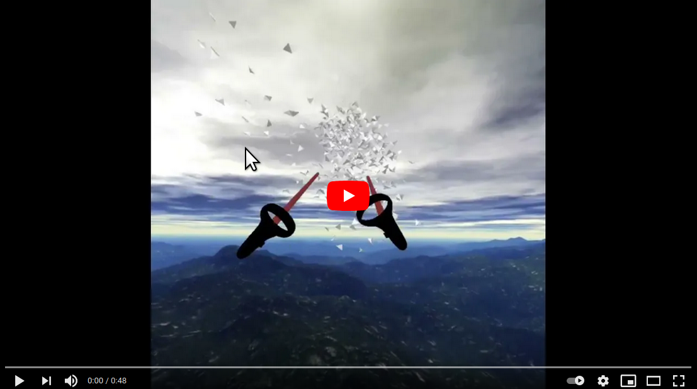

This is a [boids](https://en.wikipedia.org/wiki/Boids) demo, with optional VR headset support.

Here's the [demo](https://boidsxr.github.io/boids-xr/)

Using a VR headset you'll see the boids fly around you, and you can steer them with the controller.

## Video

## Who

[maxf](https://github.com/maxf) and [danbri](https://github.com/danbri)

## What

Boids is an artificial life program, developed by Craig Reynolds in 1986, which simulates the flocking behaviour of birds.

More [background and technical details](docs/README.md)

## Licence & Copyright

Same as three.js's [MIT Licence](https://github.com/mrdoob/three.js/blob/master/LICENSE)

Three.js code: Copyright © 2010-2021 three.js authors

Modifications and extra code: Copyright © 2021 Max Froumentin
